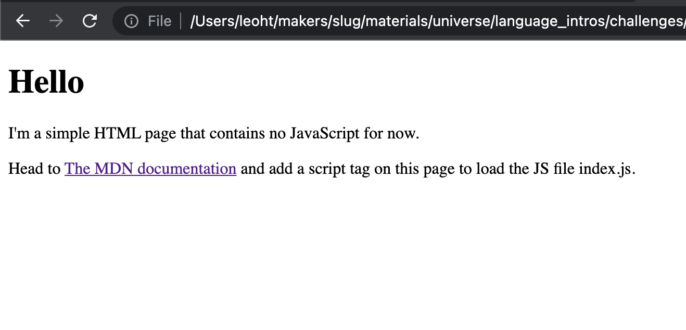
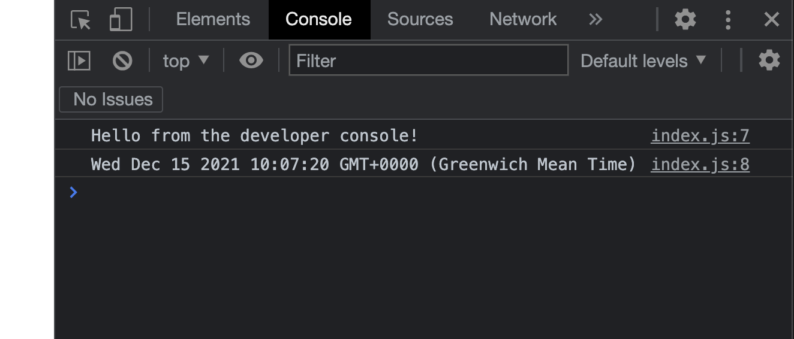
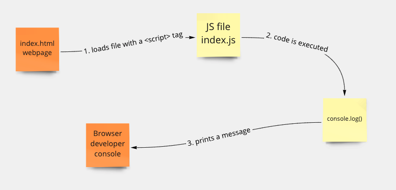

# JavaScript and the browser

## Objectives

 * Load a JavaScript file in the browser.
 * Use the browser JS console.
 * Use `console.log` to print in the console.

<!-- OMITTED -->

In this first section, you'll **discover with an example** how JavaScript can be
executed within a web browser — rather than Node.js — and how we can get
visibility into our code. 

## Downloading the exercise directory

You will first need to download [the provided files for this first
example](../resources/example-1.zip) to work through the exercises. Unzip this
in a new directory `example-1` and open it in your code editor. You should have the
following files:
 * `index.html`
 * `index.js`
 * `package.json`
 * `package-lock.json`

The first three of these will be present in almost all of the exercises in the 
rest of the module.
* `index.js` is the **main JS file**, if you have other files in the project, 
these will be required inside `index.js`
* `index.html` is the HTML document which tells your browser to load `index.js`.
It does this through a `<script>` tag.
* `package.json` contains information about the project, including scripts you
can run and any external packages your project needs (these are like _gems_ in
ruby). You can use `npm init -y` to create one when setting up a new project.


### Setup

The presence of `package.json` tells us that there are dependencies to install.
Run `npm install` inside the directory to install them (they'll be useful in the
next section):

```bash
$ npm install
```

Next, open the HTML file in your browser. You should see a title and two
paragraphs.



## Exercise

To complete the exercise you'll need to:
 * research [how to use a `<script>`
   tag](https://developer.mozilla.org/en-US/docs/Web/HTML/Element/script#basic_usage)
   to load a JavaScript file on the page.
 * use the developer console.

1. Modify the HTML code in the file `index.html`, to load the main file `index.js` on the page, using a `<script>` tag at the end of the body.
2. Reload the page in your browser. You should be able to open the
   browser's developer console from this page and see the message `'Hello from
   the developer console!'` logged.
3. Update the main JS file to log to the console [`new Date()`](https://developer.mozilla.org/en-US/docs/Web/JavaScript/Reference/Global_Objects/Date/Date).
   If you reload the page, you should be able to see the current date printed in
   the console.



### Troubleshooting common problems

 * The browser is quite strict on the `<script>` tag syntax — make sure you
   follow the example in the resource linked above.

## The Developer Console

As you've seen in the previous exercise, using `console.log` in the browser behaves
slightly differently to when using it in Node. Any output is printed to the browser
developer console, so remember to have it open at all times! In Chrome, the
shortcut to open it quickly is `Option`+`Command`+`J` on Mac.

**Keep in mind that `console.log` does not write on the page — it is used only
for you to debug using the developer console, not to display information to the
users of the application**

## Diagram

Here's a diagram of what we've covered in this first section. There will be a
lot of new concepts to understand in this module, and diagramming can be a
really powerful tool. You're encouraged to make your own diagrams, and validate
them with your peers or coaches.



## Additional resources

 * [MDN - The `<script>`
   element](https://developer.mozilla.org/en-US/docs/Web/HTML/Element/script#basic_usage)
 * [Log messages with the Chrome developer
   console](https://developer.chrome.com/docs/devtools/console/log/)

[Next Challenge](02_build_tool.md)

<!-- BEGIN GENERATED SECTION DO NOT EDIT -->

---

**How was this resource?**  
[😫](https://airtable.com/shrUJ3t7KLMqVRFKR?prefill_Repository=makersacademy/javascript-web-applications&prefill_File=contents/01_javascript_browser.md&prefill_Sentiment=😫) [😕](https://airtable.com/shrUJ3t7KLMqVRFKR?prefill_Repository=makersacademy/javascript-web-applications&prefill_File=contents/01_javascript_browser.md&prefill_Sentiment=😕) [😐](https://airtable.com/shrUJ3t7KLMqVRFKR?prefill_Repository=makersacademy/javascript-web-applications&prefill_File=contents/01_javascript_browser.md&prefill_Sentiment=😐) [🙂](https://airtable.com/shrUJ3t7KLMqVRFKR?prefill_Repository=makersacademy/javascript-web-applications&prefill_File=contents/01_javascript_browser.md&prefill_Sentiment=🙂) [😀](https://airtable.com/shrUJ3t7KLMqVRFKR?prefill_Repository=makersacademy/javascript-web-applications&prefill_File=contents/01_javascript_browser.md&prefill_Sentiment=😀)  
Click an emoji to tell us.

<!-- END GENERATED SECTION DO NOT EDIT -->
