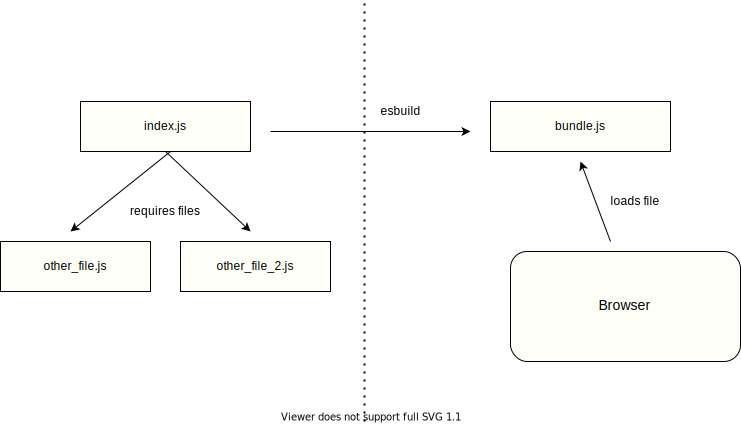

# Using a build tool

## Objectives

 * Understand why a build tool is useful.
 * Use esbuild to bundle different JS files together.
 * Use esbuild and NPM scripts to run a build process for JS webapp.

Real JavaScript programs are usually composed of many different files, much like programs in other languages. As seen previously, we can use the `<script>` tag to load JS files in the browser and run them. However, as we add more Javascript files (functions, classes, etc) in our application, the number of files to load is becoming harder to manage. Also, some JS files will need to be loaded *after* others they might depend on, which could lead to situation like this:

```html
<!DOCTYPE html>
<html lang="en">
<head>
  <meta charset="UTF-8">
  <meta http-equiv="X-UA-Compatible" content="IE=edge">
  <meta name="viewport" content="width=device-width, initial-scale=1.0">
  <title>My web app</title>
</head>
<body>
  (...)

  <script src="src/js/user_auth.js" type="text/javascript"></script>
  <script src="src/js/login.js" type="text/javascript"></script>
  <script src="src/js/signup.js" type="text/javascript"></script>
  <script src="src/js/post.js" type="text/javascript"></script>
  <script src="src/js/post_loader.js" type="text/javascript"></script>
  (...)
</body>
</html>
```

To avoid this (and other issues as well), we can use what is called a *build tool*. Most modern JavaScript codebases will use some kind of build tool as part of their tooling. On a high level, a build tool "loads" all the required JS files, figures out in which order they should be loaded (depending on which depends on which), and generates a single "bundled" JavaScript file, that we can simply load into the browser.

Often, this file is also minified and compressed to minimise resources and time needed to transmit it over the network. Some complex JavaScript codebases might represent a few megabytes, and thousands of lines of code, so that's also important!

There are a few options out there, we'll use [`esbuild`](https://esbuild.github.io/getting-started/) as it is simple enough for us to get started without doing too much configuration.

```bash
$ npm install esbuild
```

We can then execute esbuild from the terminal, in our project directory:

```bash
$ esbuild index.js --bundle --outfile=bundle.js --watch
```

 * `index.js` is the *entrypoint* of our JavaScript program. In other words, is the file that *requires* other files, but that is not required by any other.
 * `bundle.js` is the name of the bundled file that will be loaded by the browser.
 * the `--watch` option tells esbuild to automatically regenerate the bundle when changes to source files are made.

Here's a diagram of how a build tool such as esbuild is compiling source files into a bundled file loaded by the browser:



## Exercise - Hello, bundle

In a new directory `hello_bundle`, create the following file `index.html`:

```html
<!DOCTYPE html>
<html lang="en">
<head>
  <meta charset="UTF-8">
  <meta http-equiv="X-UA-Compatible" content="IE=edge">
  <meta name="viewport" content="width=device-width, initial-scale=1.0">
  <title>Hello, bundle</title>
</head>
  <body>

  </body>
</html>
```

To complete this exercise, you'll need to:
 * run esbuild to generate a bundle file from an input file.
 * use a `<script>` tag.

### Questions
1. Implement a file `hello.js` that prints the message "Hello, bundle" using `console.log`.
2. Using `esbuild` as shown previously, generates a bundle file `bundle.js`
3. Load this bundle in the HTML index page so when opening it in the browser, the message "Hello, bundle" is displayed in the developer console.

## Exercise - bundling many files

Work through the following questions in a new directory, perhaps called `bundle_exercise_2`, to avoid confusion with the previous exercise.

### Questions

1. Define and export a function `add`, which returns the sum of two numbers, in a file `add.js`.
2. Define and export a function `multiply`, which returns the product of two numbers, in a file `multiply.js`.
3. In a file `index.js`, require and use the two previous functions to calculate `(2 + 2) * 4` and print the result to the console.
4. Use esbuild to generate a single bundle file and load it into an HTML page `index.html`

When opening the page, you should see the message with the correct value (16) printed to the console. You should load only a single `<script>`, the bundled file generated with esbuild.

## Exercise - debugging

Someone from your cohort worked through the previous exercise, however their page doesn't seem to print anything. The HTML `<script>` tag is written correctly, and the JS code seems good as well. They executed esbuild using the following command:

```bash
$ esbuild add.js --bundle  --outfile=bundle.js --watch
```

1. What is wrong with what they did? How should you modify the code or command so the page prints the message as expected?

## Using NPM scripts to run the build

Memorising how to run the `esbuild` command can be hard, so we can use NPM scripts to save some time. If your project directory doesn't contain a file `package.json` yet, remember you can generate one by running `npm init`.

```json
{
  "name": "bundle_exercise",
  "version": "1.0.0",
  "description": "",
  "main": "index.js",
  "scripts": {
    "build": "esbuild index.js --bundle  --outfile=bundle.js --watch",
    "test": "echo \"Error: no test specified\" && exit 1"
  },
  "author": "",
  "license": "ISC"
}

```

## Note for the next steps

In the next sections, we'll assume that a "build" script is defined inside the `package.json`, like we've just seen. To simplify, we'll be able to run the command to build and watch for changes using NPM:

```
$ npm run build
```

We'll also assume that:
 * our entrypoint file will *always* be named `index.js`, and this file will require all other files needed for our program to function. 
 * our bundle file will *always* be named `bundle.js`, and this will be the only file loaded by the HTML page.

[Next Challenge](03_interacting_with_the_page.md)

<!-- BEGIN GENERATED SECTION DO NOT EDIT -->

---

**How was this resource?**  
[😫](https://airtable.com/shrUJ3t7KLMqVRFKR?prefill_Repository=makersacademy/javascript-web-applications&prefill_File=contents/02_build_tool.md&prefill_Sentiment=😫) [😕](https://airtable.com/shrUJ3t7KLMqVRFKR?prefill_Repository=makersacademy/javascript-web-applications&prefill_File=contents/02_build_tool.md&prefill_Sentiment=😕) [😐](https://airtable.com/shrUJ3t7KLMqVRFKR?prefill_Repository=makersacademy/javascript-web-applications&prefill_File=contents/02_build_tool.md&prefill_Sentiment=😐) [🙂](https://airtable.com/shrUJ3t7KLMqVRFKR?prefill_Repository=makersacademy/javascript-web-applications&prefill_File=contents/02_build_tool.md&prefill_Sentiment=🙂) [😀](https://airtable.com/shrUJ3t7KLMqVRFKR?prefill_Repository=makersacademy/javascript-web-applications&prefill_File=contents/02_build_tool.md&prefill_Sentiment=😀)  
Click an emoji to tell us.

<!-- END GENERATED SECTION DO NOT EDIT -->
