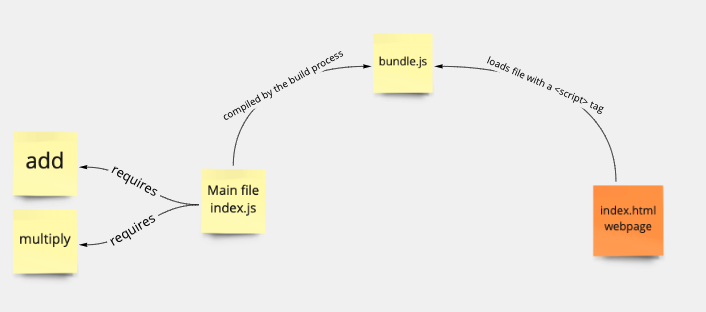

# Bundling many files

## Objectives

 * Use esbuild to bundle different JS files.

### A Reminder about JS modules

Remember that a function is exported from its file using `module.exports`, and
required from another file using `require`:

```js
// myFunction.js

const myFunction = () => { <!-- OMITTED --> };

module.exports = myFunction;
```

```js
// index.js
const myFunction = require('./myFunction');

// ...
```

## Exercise

**Using the same project directory** than in the previous section, you will:
 * Define functions into new JS files and use them from the main file.
 * Run the build process to compile everything into a single bundle file.

### Questions

1. In a new file `add.js`, define and export a function `add`, which returns the
   sum of two numbers.
2. In a new file `multiply.js`, define and export a function `multiply`, which
   returns the product of two numbers.
3. In the main file, **require and use the two previous functions to calculate
   `(2 + 2) * 4` and print the result to the console (16)**.
4. Make sure to run `npm run build` to regenerate the bundle file (if that
   command wasn't already running in a terminal). Also make sure the bundle file
   is loaded by the HTML page `index.html`.
5. Open the page and verify the result is printed in the console.
6. Change the numbers in the operation in `index.js` — the file `bundle.js`
   should be automatically regenerated and, after refreshing the page, you
   should see a new result in the console.

<details>
  <summary>Reveal suggested walkthrough</summary>

  1. Contents of `add.js`:
  ```js
  module.exports = (a, b) => {
    return a + b;
  }
  ```

  2. Contents of `multiply.js`:
  ```js
  module.exports = (a, b) => {
    return a * b;
  }
  ```

  3. Contents of `index.js`:
  ```js
  const add = require('./add');
  const multiply = require('./multiply');

  console.log(multiply(add(2, 2), 4));
  ```

  4. Command to run to generate the bundled file:
  ```bash
  $ npm run build
  ```

  5. HTML code loading the bundled file:
  ```html
  <!DOCTYPE html>
  <html lang="en">
  <head>
    <title>Hello JavaScript</title>
  </head>
    <body>
      <!-- ... -->
      <script type="text/javascript" src="bundle.js"></script>
    </body>
  </html>
  ```

  6. You should see the result (16) printed in the browser console.
     </details>

## How does it work?

Thanks to this line in `package.json`:

```json
"scripts": {
  // ...
  "build": "esbuild index.js --bundle  --outfile=bundle.js --watch"
},
```

When we run `npm run build`, this command is then executed for us by NPM:

```bash
$ esbuild index.js --bundle --outfile=bundle.js --watch
```

 * `index.js` is the main file of our JavaScript program. In other words, is the
   file that *requires* other files, but that is not required by any other.
 * `bundle.js` is the name of the bundle file that will be loaded by the
   browser.
 * the `--watch` option tells esbuild to automatically regenerate the bundle
   when we change source files.

## Diagram

Here's a diagram of how a build tool such as esbuild compiles different source
files into a bundle file loaded by the browser:




[Next Challenge](04_notes_app_scaffold.md)

<!-- BEGIN GENERATED SECTION DO NOT EDIT -->

---

**How was this resource?**  
[😫](https://airtable.com/shrUJ3t7KLMqVRFKR?prefill_Repository=makersacademy/javascript-web-applications&prefill_File=contents/03_build_tool_2.md&prefill_Sentiment=😫) [😕](https://airtable.com/shrUJ3t7KLMqVRFKR?prefill_Repository=makersacademy/javascript-web-applications&prefill_File=contents/03_build_tool_2.md&prefill_Sentiment=😕) [😐](https://airtable.com/shrUJ3t7KLMqVRFKR?prefill_Repository=makersacademy/javascript-web-applications&prefill_File=contents/03_build_tool_2.md&prefill_Sentiment=😐) [🙂](https://airtable.com/shrUJ3t7KLMqVRFKR?prefill_Repository=makersacademy/javascript-web-applications&prefill_File=contents/03_build_tool_2.md&prefill_Sentiment=🙂) [😀](https://airtable.com/shrUJ3t7KLMqVRFKR?prefill_Repository=makersacademy/javascript-web-applications&prefill_File=contents/03_build_tool_2.md&prefill_Sentiment=😀)  
Click an emoji to tell us.

<!-- END GENERATED SECTION DO NOT EDIT -->
