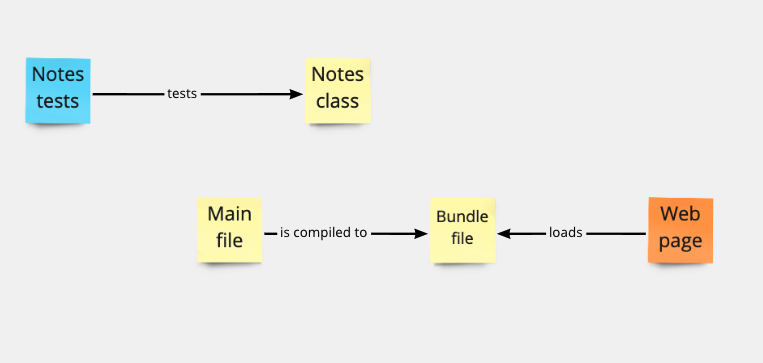

# Test-driving the Model class

## Objectives

  * Test-drive a JavaScript "Model" class to hold the program's state.

You will **use the same project directory `notes-app`** for this new task.

## Demonstration

Here is [a video demonstration](https://www.youtube.com/watch?v=YGbPa91Y5tg) of a coach test-driving a "Model" class.

## Exercise one

You will now implement, test-driving, a JavaScript class to hold our program data (the
**model** class). This will be similar to previous classes you've written, acting as a "wrapper" for our program's state.

Here's an acceptance criteria for this class — how we want it to behave, once implemented:

```js
const model = new NotesModel();

model.getNotes(); // should return []

model.addNote('Buy milk');
model.addNote('Go to the gym');

model.getNotes(); // should now return ['Buy milk', 'Go to the gym']

model.reset();

model.getNotes(); // should now return []
```

### Questions

1. Install `jest` in the project directory with `npm install --save jest` and create a
   test file `notesModel.test.js`.
2. Write the test cases for `NotesModel` (at least three) verifying the acceptance
   criteria shown above, and test-drive the `NotesModel` class (in `notesModel.js`), one test at a time. To test arrays, prefer the use of `.toEqual()` matcher over `.toBe()`.

## Exercise two

We've now implemented the class `NotesModel` — but it is not loaded by our web page yet.
It only exists on its own, outside of the web page. Here's a rough diagram on how things
are in our `notes-app` project, as of now:



By requiring the `NotesModel` class from the main file `index.js`, it will be "bundled"
too into the bundle file, and loaded by the web page.

### Questions

1. Update the code in the main file so it:
    * `require`s the `NotesModel` class and creates a new instance of it in a variable.
    * `console.log` the current list of notes, returned by the `getNotes()` method.
2. Make sure `npm run build` is running.
3. Open (or refresh) the web page — you should see the empty array of notes `[]` being
   logged in the console.
4. How would you modify the previous diagram to reflect the changes you made?

## Troubleshooting

* When writing your tests using the `.toBe()` Jest matcher, you might run into this error:
   ```
   Expected: ["Buy milk"]
   Received: serializes to the same string
   ```

   You should use the `.toEqual()` matcher to test arrays, as explained in [this
   StackOverflow answer](https://stackoverflow.com/a/46256046).

* If you're getting the error `TypeError: NotesModel is not a constructor` — maybe you
  forgot to export the class from its file?

<details>
  <summary>Reveal suggested walthrough</summary>

   ```js
   // notesModel.test.js

   const NotesModel = require('./notesModel');

   describe('Notes model class', () => {
      it('starts with no notes', () => {
         const notes = new NotesModel();

         expect(notes.getNotes()).toEqual([]);
      });

      it('adds a notes', () => {
         const notes = new NotesModel();
         notes.addNote('Buy milk');

         expect(notes.getNotes()).toEqual(['Buy milk']);
      });

      it('resets the list of notes', () => {
         const notes = new NotesModel();
         notes.addNote('Buy milk');
         notes.reset();

         expect(notes.getNotes()).toEqual([]);
      });
   });
   ```

   ```js
   // nodesModel.js

   class NotesModel {
      constructor() {
         this.notes = [];
      }

      getNotes() {
         return this.notes;
      }

      addNote(note) {
         this.notes.push(note);
      }

      reset() {
         this.notes = [];
      }
   }

   module.exports = NotesModel;
   ```
</details>

---

We now have a project directory setup for our notes app, with a simple model class. We'll come
back to it — but first, let's learn how to interact with the web page using JavaScript.

[Next Challenge](05_interacting_with_the_page.md)

<!-- BEGIN GENERATED SECTION DO NOT EDIT -->

---

**How was this resource?**  
[😫](https://airtable.com/shrUJ3t7KLMqVRFKR?prefill_Repository=makersacademy%2Fjavascript-web-applications&prefill_File=contents%2F04_test_driving_notes_class.md&prefill_Sentiment=😫) [😕](https://airtable.com/shrUJ3t7KLMqVRFKR?prefill_Repository=makersacademy%2Fjavascript-web-applications&prefill_File=contents%2F04_test_driving_notes_class.md&prefill_Sentiment=😕) [😐](https://airtable.com/shrUJ3t7KLMqVRFKR?prefill_Repository=makersacademy%2Fjavascript-web-applications&prefill_File=contents%2F04_test_driving_notes_class.md&prefill_Sentiment=😐) [🙂](https://airtable.com/shrUJ3t7KLMqVRFKR?prefill_Repository=makersacademy%2Fjavascript-web-applications&prefill_File=contents%2F04_test_driving_notes_class.md&prefill_Sentiment=🙂) [😀](https://airtable.com/shrUJ3t7KLMqVRFKR?prefill_Repository=makersacademy%2Fjavascript-web-applications&prefill_File=contents%2F04_test_driving_notes_class.md&prefill_Sentiment=😀)  
Click an emoji to tell us.

<!-- END GENERATED SECTION DO NOT EDIT -->
