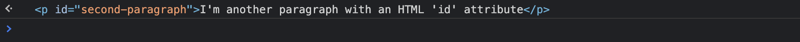
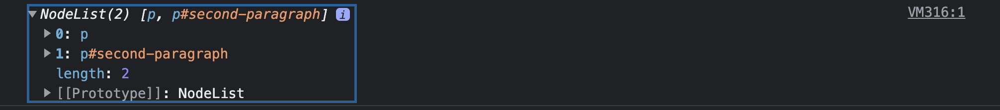
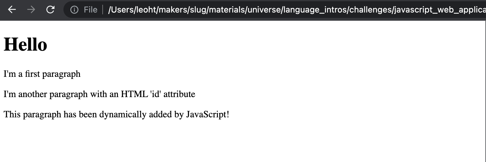

# Updating the page content

## Objectives

 * Explain what is the DOM.
 * Use JavaScript to dynamically change the page content.
 * Use JavaScript to dynamically add a new element on the page.

<!-- OMITTED -->

In this section, you will discover with an example how we can use JavaScript
to interact with elements in a web page. We do this through something called
the Document Object Model (DOM).

When your browser interprets HTML, it turns the document from HTML tags into
a tree of objects. These objects are known as the DOM, and we can interact
with them using JavaScript. [Read more about the DOM here](../pills/manipulating_dom_with_javascript.md)

## Video demonstration

[Here is a video demonstration of how to use JavaScript to dynamically change the page.](https://www.youtube.com/watch?v=W4wpGM99K4A)

## Downloading the exercise directory

To work through the following exercises, you'll need to download and unzip [example-2](../resources/example-2.zip).
Once you've unzipped the folder, open it in your code editor and install the
dependencies with `npm install`.

1. Have a look at the `index.html` file and notice the structure of the HTML
   page.
2. Now have a look at the `index.js` and `view.js` files and notice any new
   syntax inside. You'll also notice a test file `view.test.js` — ignore it for
   now, we'll come back to it.
3. In your browser, open the HTML page and check the developer console to see
   what is logged.

The element `

` logged in the console is the value
inside `this.mainContainerEl`. It represents the corresponding HTML element on 
the page — giving us a "reference" to that element.

By manipulating this variable, we can now interact with the element that is
displayed. We can change its content, its CSS style properties, clone it, or
remove it from the page altogether.

## Exercise - querying elements

Before moving ahead, let's get comfortable with querying elements on the page
and storing them into JS variables. This is important so you can start building a mental model of how this works, before using it in a project.

For this exercise, you will [type JavaScript
code directly into the developer
console](https://developer.chrome.com/docs/devtools/console/javascript/) (the
same place where `console.log` messages are showing), rather than writing that
code down in files.

**This exercise will require you to do some research on how to use:**
  * `document.querySelector` and `document.querySelectorAll`
  * the `.textContent` property

### Questions

Inside the developer console (staying on the same web page from the example
directory):

1. Query the document to get the DOM value representing the HTML element for the
   **second paragraph** (you can use its HTML ID to target it). Store this value
   in a variable and print it to the console. You should get the following result:
   
2. Update the `.textContent` property of this variable to change the text inside this
   element. You should be able to see this change reflected on the page.
3. Query the document to get the DOM value representing the list of **all paragraphs**
   in the document. Store the list in a variable, and print it to the console. You
   should get the following result: 

[Solution video](https://www.youtube.com/watch?v=S55OUdXpY4o)

### Troubleshooting common problems

 * Keep in mind `document.querySelector` will return a single element, whereas
 `document.querySelectorAll` returns a **list of elements**.

### A short note about HTML id and class and their selectors

You might know already that HTML elements can have `id` or `class` attributes.
An `id` is unique within the page, but many elements can have the same `class`.

When using `document.querySelector`, we can use the CSS selector `#my-id` to
target the element with `id="my-id"`, and `.my-class` to target the element(s)
with `class="my-class"`.

You can read more about [using CSS selectors on
MDN](https://developer.mozilla.org/en-US/docs/Web/CSS/CSS_Selectors). Usually
all CSS selectors can be used with `document.querySelector`, etc. For this
module, you'll need only to know about the id and class selectors.

## Exercise - adding content

This exercise builds on the previous one, so you can start where you left off, in the directory `example-2`.
It will require you to do some research on how to
 * [append a new element to the
   page](https://developer.mozilla.org/en-US/docs/Web/API/Element/append#appending_an_element)
   using `document.createElement` and the `.append()` method.

### Questions

**You should not change the HTML file contents; you'll use JS to dynamically**
**change the page**.

Work through the following steps by updating the `View` class in `view.js`:

1. Implement a new method `addParagraph` on `View` — this method should *dynamically create a
   new `p` element* and store it in a variable.
2. *Set this new element's content* to the string `'This paragraph has been
   dynamically added by JavaScript!` (or something else).
3. *Append the element* to the main container element.
4. In the main file, (`index.js`) call this new method on the existing `View` instance.

When opening the HTML page, you should now see this third paragraph being added
after the two other ones.

[Solution video](https://youtu.be/S55OUdXpY4o?t=147)

### Separation of concerns

You've noticed that we kept all the code using `document.querySelector` and
other DOM methods (everything that modifies the page content) inside the `View`
class. This is an example of separation of concerns. Like in other tech stacks,
it's important that we keep our code clean and well designed when working with
JavaScript and the web.

## Additional resources

 * [Manipulating the DOM in JavaScript](../pills/manipulating_dom_with_javascript.md)
 * [Introduction to the DOM —
   MDN](https://developer.mozilla.org/en-US/docs/Web/API/Document_Object_Model/Introduction)
 * [`document.querySelector` on
   MDN](https://developer.mozilla.org/en-US/docs/Web/API/Document/querySelector)

[Next Challenge](06_testing_page_content.md)

<!-- BEGIN GENERATED SECTION DO NOT EDIT -->

---

**How was this resource?**  
[😫](https://airtable.com/shrUJ3t7KLMqVRFKR?prefill_Repository=makersacademy%2Fjavascript-web-applications&prefill_File=contents%2F05_interacting_with_the_page.md&prefill_Sentiment=😫) [😕](https://airtable.com/shrUJ3t7KLMqVRFKR?prefill_Repository=makersacademy%2Fjavascript-web-applications&prefill_File=contents%2F05_interacting_with_the_page.md&prefill_Sentiment=😕) [😐](https://airtable.com/shrUJ3t7KLMqVRFKR?prefill_Repository=makersacademy%2Fjavascript-web-applications&prefill_File=contents%2F05_interacting_with_the_page.md&prefill_Sentiment=😐) [🙂](https://airtable.com/shrUJ3t7KLMqVRFKR?prefill_Repository=makersacademy%2Fjavascript-web-applications&prefill_File=contents%2F05_interacting_with_the_page.md&prefill_Sentiment=🙂) [😀](https://airtable.com/shrUJ3t7KLMqVRFKR?prefill_Repository=makersacademy%2Fjavascript-web-applications&prefill_File=contents%2F05_interacting_with_the_page.md&prefill_Sentiment=😀)  
Click an emoji to tell us.

<!-- END GENERATED SECTION DO NOT EDIT -->
