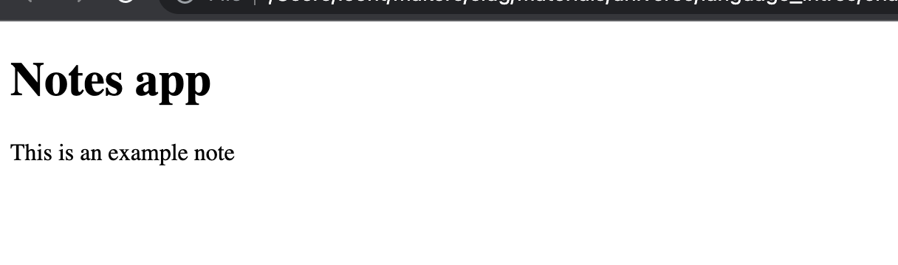

# Test-driving the `NotesView` class

## Objectives

 * Write a test to check the updates to the web page.
 * Test-drive a feature for a frontend web application.

In this section, you'll **apply new knowledge** from previous sections continuing the work
in the `notes-app` project directory.

You will test-drive a new class `NotesView` which will be responsible to reflect the
model's data (the list of notes) on the page (by dynamically creating HTML elements).

At the end of section 4 *(Test-driving the `NotesModel` class)*, you ended up with the
following code in the main file:

```js
// index.js
const NotesModel = require("./notesModel");

const model = new NotesModel();
console.log(model.getNotes());
```

## Challenge

Test-drive a new class `NotesView`, similar to the `View` class seen in the previous
example.

This class will:
  * have a constructor
      * the `model` should be dependency-injected into it.
  * have a method `displayNotes` which will:
      * get the list of notes from the model.
      * for each note, create a new `div` element on the page (with an HTML class
        `"note"`). 

You'll have to research how an HTML class can be set to an element in JavaScript.

### Troubleshooting common problems

* If, when running the test, you're getting an error such as `document is not defined` or
  `Cannot read property 'append' of null` — make sure you've setup your test like in
  the template.
* If the number of elements returned by `document.querySelectorAll` is still zero after
  implementing the new method — did you make sure to set the HTML class `note` on the new
  elements?

<details>
  <summary>Reveal suggested walkthrough</summary>

  ```js
  // notesView.test.js

  /**
   * @jest-environment jsdom
   */

  const fs = require('fs');

  const NotesModel = require('./notesModel');
  const NotesView = require('./notesView'); 

  describe('Notes view', () => {
    it('displays two notes', () => {
      document.body.innerHTML = fs.readFileSync('./index.html');

      // 1. Setting up model and view
      const model = new NotesModel();
      const view = new NotesView(model);
      model.addNote('A first note');
      model.addNote('Another one');
      
      // 2. Display the notes on the page
      view.displayNotes();

      // 3. There should now be 2 div.note on the page
      expect(document.querySelectorAll('div.note').length).toEqual(2);
    });
  });
  ```

  ```js
  // notesView.js

  class NotesView {
    constructor(model) {
      this.model = model;
      this.mainContainerEl = document.querySelector('#main-container');
    }
    
    displayNotes() {
      const notes = this.model.getNotes()

      // For each note, create and append a new element on the main container
      notes.forEach(note => {
        const noteEl = document.createElement('div');
        noteEl.textContent = note;
        noteEl.className = 'note';
        this.mainContainerEl.append(noteEl);
      })
    }
  }

  module.exports = NotesView;
  ```
</details>

## Exercise - Showing notes on the page

In this exercise, we'll use load our new class in the main file so it can change the web
page content.

*Remember to make sure the task `npm run build` is still running in a terminal — otherwise
your changes will have no effect on the page.*

### Questions

1. In the main file:
    * Create a model and add a new note with the contents `'This is an example note'`.
    * Setup an instance of `NotesView` like in our test, injecting our model into it.
    * Call the `displayNotes` method.
2. Refresh or re-open the HTML page. You should see the note `This is an example note`
   displayed on the page.



<details>
  <summary>Reveal suggested walkthrough</summary>

  ```js
  // index.js
  const NotesModel = require("./notesModel");
  const NotesView = require("./notesView");

  // 1. Setup the model with one note
  const model = new NotesModel();
  model.addNote('This is an example note');

  // 2. Setup the view
  const view = new NotesView(model);

  // 3. Make the view display notes
  view.displayNotes();
  ```
</details>

## Diagram

Here's a diagram representing the relationship between the two classes we have so far (the
model and view classes), and how it impacts what the user sees on the page.


In the last exercises, we've seen how we can dynamically update the page content to
display the state of our program. In the next section, we'll see how we can also react to
user interaction, to allow the web page user to modify the program state.


[Next Challenge](08_user_interaction.md)

<!-- BEGIN GENERATED SECTION DO NOT EDIT -->

---

**How was this resource?**  
[😫](https://airtable.com/shrUJ3t7KLMqVRFKR?prefill_Repository=makersacademy%2Fjavascript-web-applications&prefill_File=contents%2F07_adding_new_note.md&prefill_Sentiment=😫) [😕](https://airtable.com/shrUJ3t7KLMqVRFKR?prefill_Repository=makersacademy%2Fjavascript-web-applications&prefill_File=contents%2F07_adding_new_note.md&prefill_Sentiment=😕) [😐](https://airtable.com/shrUJ3t7KLMqVRFKR?prefill_Repository=makersacademy%2Fjavascript-web-applications&prefill_File=contents%2F07_adding_new_note.md&prefill_Sentiment=😐) [🙂](https://airtable.com/shrUJ3t7KLMqVRFKR?prefill_Repository=makersacademy%2Fjavascript-web-applications&prefill_File=contents%2F07_adding_new_note.md&prefill_Sentiment=🙂) [😀](https://airtable.com/shrUJ3t7KLMqVRFKR?prefill_Repository=makersacademy%2Fjavascript-web-applications&prefill_File=contents%2F07_adding_new_note.md&prefill_Sentiment=😀)  
Click an emoji to tell us.

<!-- END GENERATED SECTION DO NOT EDIT -->
