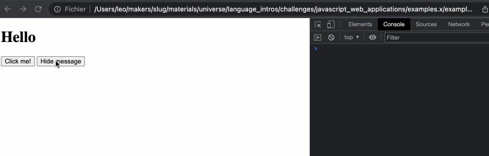

# Handling user interaction

## Objectives

 * Understand what browser events are.
 * Use JavaScript to handle an event (such as a mouse click).
 * Change the web page dynamically in response to a user event.

In this section, you will **discover with an example** how we can use JavaScript
code to handle user interaction (e.g detect when a user clicks on the page) and
modify the page in response to it.

This is the basis for all dynamic websites! Once we can modify, add, and remove
elements from the DOM based on user interaction, we can build a web page in the
browser!

## Downloading the exercise directory

You'll need to download [the provided files for this
section](../resources/example-3.zip). Unzip this in a new directory `example-3` and
open it in your code editor.

1. As usual, run `npm install` to install dependencies, and `npm run build` in
   the background.
2. Look at the main file and the `MessageView` class and notice anything that
   looks new.
3. Open the web page and open the developer console to check logged messages.
   **Click the button** and **check the message being logged in the console.**

## Event listeners

In this section, we'll use something new — event listeners. An event listener
is a callback function "attached" to a specific event (like `click` for a mouse
click). We attach this to an element, by calling `.addEventListener` on that
element.

```js
// 1. Getting a reference to the button
const myButton = document.querySelector('#my-button');

// 2. Attaching an event listener function - it will be executed only when the event "happens"
myButton.addEventListener('click', () => {
  // 3. The user clicked, do something interesting now!
  console.log('button clicked!');
})
```

The above code is very similar to what you see in `messageView.js`

By attaching listeners to specific events, we can execute code when the user
interacts with our web page. 

There are [an enormous number of events](https://developer.mozilla.org/en-US/docs/Web/Events#event_listing)
available for us to listen for, everything from mouse clicks, key strokes
and scrolling, to rotating your device, printing the page or even plugging
in a gamepad! But for now we'll stick to clicks.

## Demonstration

[Here is a video demonstration.](https://www.youtube.com/watch?v=QouSjlzRpXc)

## Exercise one

Look at the test file `messageView.test.js` in the example directory. The
structure looks similar to the one previously encountered:

```js
/**
 * @jest-environment jsdom
 */

const fs = require('fs');
const MessageView = require('./messageView');

describe('MessageView', () => {
   it('clicks the button', () => {
      document.body.innerHTML = fs.readFileSync('./index.html');

      const view = new MessageView();

      const buttonEl = document.querySelector('#show-message-button');
      buttonEl.click();

      expect(document.querySelector('#message')).not.toBeNull();
   });
});
```

The test itself is slightly different this time:
 * we simulate a click on the button with `.click()`.
 * we check that there is an element with an HTML ID `message` on the document.

If you run this test with `jest`, you will notice it doesn't pass, for now.
**You'll need to add the missing code so that it does.**

### Questions

1. Modify the method `displayMessage` to add a `div` element to the main
container. Give this `div` element an `id` of `message`, and set its content to `This
message displayed by JavaScript`.
    * You'll have to research how to set the HTML ID for this element.

[Example solution](https://youtu.be/QouSjlzRpXc?t=375)

## Exercise two - removing the message from the page

You'll now test-drive a second button to **remove the message from the page when
the user clicks on it.** For this exercise you'll need to research:
  * How to remove a DOM element with JavaScript.

### Questions

1. Duplicate the button inside `index.html` and set the new button's ID to
   `hide-message-button`. 
2. Write a new test case that checks the opposite behaviour: after a click on
   this button, the element `#message` should _not_ be present on the page.
3. Update the code in `MessageView` so this new test passes:
    * Add a new method `hideMessage`.
    * Attach a new event listener to the hide button, which will listen for a
      click, and has a callback which will execute `hideMessage`.
4. You should be able to open the web page in your browser and use the two
   buttons to show or remove the message.



[Example solution](https://youtu.be/QouSjlzRpXc?t=753)

In the next section, we'll see how we can handle user input in form elements,
such as text inputs, with JavaScript code.

### Troubleshooting common problems

 * Make sure the event listener is set in the `MessageView` constructor method —
   just like the event listener already present in the example. 

## Additional resources
 * [Events reference - MDN](https://developer.mozilla.org/en-US/docs/Web/Events)

[Next Challenge](09_user_interaction_input.md)

<!-- BEGIN GENERATED SECTION DO NOT EDIT -->

---

**How was this resource?**  
[😫](https://airtable.com/shrUJ3t7KLMqVRFKR?prefill_Repository=makersacademy%2Fjavascript-web-applications&prefill_File=contents%2F08_user_interaction.md&prefill_Sentiment=😫) [😕](https://airtable.com/shrUJ3t7KLMqVRFKR?prefill_Repository=makersacademy%2Fjavascript-web-applications&prefill_File=contents%2F08_user_interaction.md&prefill_Sentiment=😕) [😐](https://airtable.com/shrUJ3t7KLMqVRFKR?prefill_Repository=makersacademy%2Fjavascript-web-applications&prefill_File=contents%2F08_user_interaction.md&prefill_Sentiment=😐) [🙂](https://airtable.com/shrUJ3t7KLMqVRFKR?prefill_Repository=makersacademy%2Fjavascript-web-applications&prefill_File=contents%2F08_user_interaction.md&prefill_Sentiment=🙂) [😀](https://airtable.com/shrUJ3t7KLMqVRFKR?prefill_Repository=makersacademy%2Fjavascript-web-applications&prefill_File=contents%2F08_user_interaction.md&prefill_Sentiment=😀)  
Click an emoji to tell us.

<!-- END GENERATED SECTION DO NOT EDIT -->
