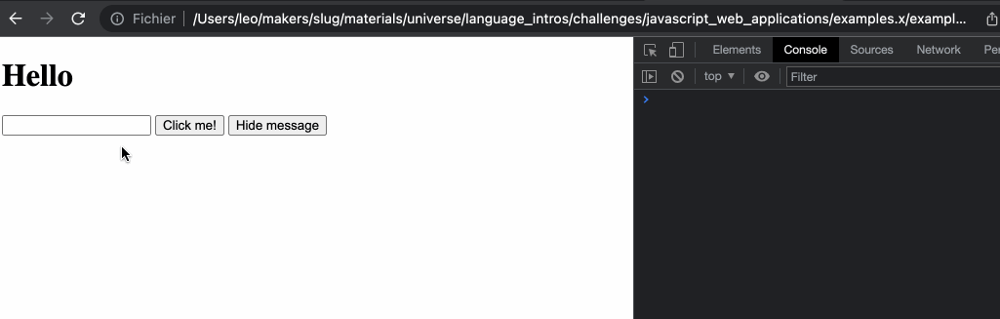

# Handling user input

## Objectives

 * Use JavaScript to read the value from a form input.

We will now use the value from a text input on the page to set the value of the
message being displayed. 

## Accessing HTML input values

An `input` HTML element can be accessed the same way in JS as other elements
such as `<div>`, `<p>`, etc. We can set an HTML class or ID to it, and then use
it `document.querySelector` to query the element:
```html
<input type="text" id="username-input" />
```
```js
const inputEl = document.querySelector('#username-input');

// We can access the current input value
// (what the user typed in) with .value
console.log(inputEl.value)

// We can also set the input's value
// (useful in tests, for example)
inputEl.value = 'Some text in there'
```

<!-- OMITTED -->

## Exercise - customising the message

We're now going to update our program (in the `example-3` directory) so it lets us customise the message that is 
shown when clicking the button.

### Questions

1. Let's first add a text input to the web page:
```html
<input type="text" id="message-input" />
```
2. Modify the first test in `messageView.test.js` so that before clicking on the
   "show" button, it sets the HTML input's
   `value` to a message of your choice. This stands in for a user entering the
   message themselves. Assert that the text content of `div#message` is equal to
   this message.
3. Modify the code of the `MessageView` class so this test passes.
4. Reload the web page in the browser. You should be able to type in a message,
   and click the button to see this message appear.



[Example solution](https://www.youtube.com/watch?v=WfLCR_Y83sM)

### Troubleshooting common problems

 * Make sure you get the `.value` of the text input element *after* the click
   happened, otherwise it might be empty.
 * Make sure that you're checking the `div`'s `textContent` in your test.

### (Again) Separation of concerns

Once again, you'll notice we've kept all the code related to web page HTML
manipulation and user interaction handling inside the `MessageView` class.

[Next Challenge](10_adding_a_note_ui.md)

<!-- BEGIN GENERATED SECTION DO NOT EDIT -->

---

**How was this resource?**  
[😫](https://airtable.com/shrUJ3t7KLMqVRFKR?prefill_Repository=makersacademy%2Fjavascript-web-applications&prefill_File=contents%2F09_user_interaction_input.md&prefill_Sentiment=😫) [😕](https://airtable.com/shrUJ3t7KLMqVRFKR?prefill_Repository=makersacademy%2Fjavascript-web-applications&prefill_File=contents%2F09_user_interaction_input.md&prefill_Sentiment=😕) [😐](https://airtable.com/shrUJ3t7KLMqVRFKR?prefill_Repository=makersacademy%2Fjavascript-web-applications&prefill_File=contents%2F09_user_interaction_input.md&prefill_Sentiment=😐) [🙂](https://airtable.com/shrUJ3t7KLMqVRFKR?prefill_Repository=makersacademy%2Fjavascript-web-applications&prefill_File=contents%2F09_user_interaction_input.md&prefill_Sentiment=🙂) [😀](https://airtable.com/shrUJ3t7KLMqVRFKR?prefill_Repository=makersacademy%2Fjavascript-web-applications&prefill_File=contents%2F09_user_interaction_input.md&prefill_Sentiment=😀)  
Click an emoji to tell us.

<!-- END GENERATED SECTION DO NOT EDIT -->
