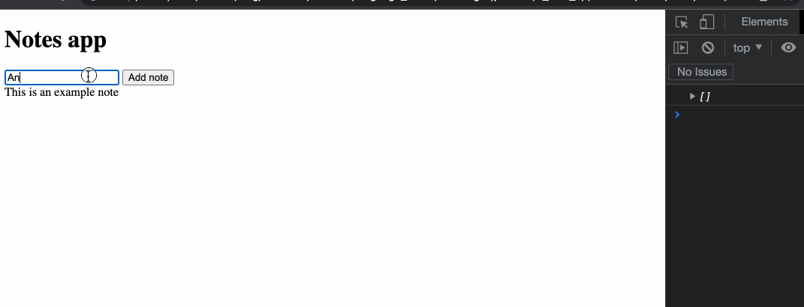
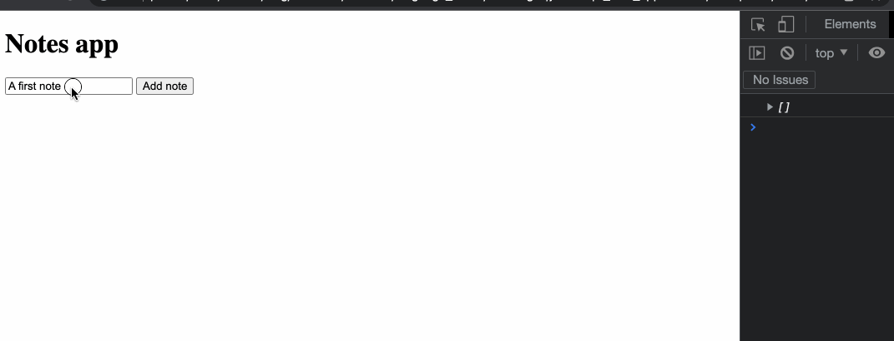
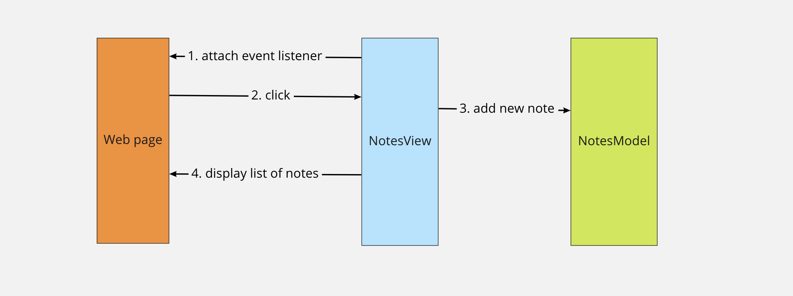

# Fixing the notes refresh

In the previous section, we implemented code so the user can type in a new
note and submit it, and refresh the list of notes on the page.

However, we also need to "clear" the list of note elements that were *already*
on the page before creating new ones.

## Exercise - clearing previous notes

This task is going to be made slightly easier thanks to the fact all our note
elements have the HTML class `note`, so we know which ones to remove from the
page. To complete this task, you'll have to research how to remove all elements
having the same class.

1. In the test file `notesView.test.js`, add a new test case for
  which verifies that when `displayNotes` is called **twice**,
   there should still be the right number of notes from the model on the page.

2. Watch this test fail, and update now the code of the `displayNotes` method to
   make it pass.

3. When trying the change on the web page, you should get a similar result:



<details>
  <summary>Reveal suggested walkthrough</summary>


  ```js
  // notesView.test.js

  // ...

  it('clear the list of previous notes before displaying', () => {
    document.body.innerHTML = fs.readFileSync('./index.html');

    const model = new NotesModel();
    const view = new NotesView(model);
    model.addNote('one');
    model.addNote('two');

    view.displayNotes();
    view.displayNotes();

    expect(document.querySelectorAll('div.note').length).toEqual(2);
  });

  // ...
  ```

  ```js
  // notesView.js

  displayNotes() {
    // 1. Remove all previous notes
    document.querySelectorAll('.note').forEach(element => {
      element.remove();
    });

    const notes = this.model.getNotes()

    // For each note, create and append a new element on the main container
    notes.forEach(note => {
      const noteEl = document.createElement('div');
      noteEl.textContent = note;
      noteEl.className = 'note';
      this.mainContainerEl.append(noteEl);
    })
  }
  ```
</details>

## Bonus exercise - clearing the input

1. It would also be nice if the text input would reset to an empty value after
   the user clicked the button. Use the `.value` property of the input element
   to reset it to a blank state.

You should now get the following result when adding a new note:



## Diagramming the View-Model interaction

Once again, you're encouraged to make your own diagrams to validate your understanding — but here's a basic one representing the interactions between the model and view class, and the web page:



So far, the only action the user can do is to add a new note (and do it more than one time), but if we extend the logic to allow other user actions, you'll notice there is a pattern that appears:
 * The Model holds the program state, or data (it is also what we would call the "source of truth")
 * The View listens to user actions on the page, and updates the page to reflect the Model's data
 * When something happens, the View updates the Model accordingly, and reflects the new data on the page again

This pattern is very common in web applications, and used (to some extent) by some popular frameworks as well.

## Saving state

You'll notice that, if we reload the page, we'll loose our list of notes — this
is because the notes, as all variables, are stored in memory by JavaScript.
**Every variable we use in the browser** will be lost once the user reloads the
page. We'll soon learn how we can fetch and update the state of our notes app on
a remote server.

[Next Challenge](12_discovering_fetch.md)

<!-- BEGIN GENERATED SECTION DO NOT EDIT -->

---

**How was this resource?**  
[😫](https://airtable.com/shrUJ3t7KLMqVRFKR?prefill_Repository=makersacademy%2Fjavascript-web-applications&prefill_File=contents%2F11_fixing_list_refresh.md&prefill_Sentiment=😫) [😕](https://airtable.com/shrUJ3t7KLMqVRFKR?prefill_Repository=makersacademy%2Fjavascript-web-applications&prefill_File=contents%2F11_fixing_list_refresh.md&prefill_Sentiment=😕) [😐](https://airtable.com/shrUJ3t7KLMqVRFKR?prefill_Repository=makersacademy%2Fjavascript-web-applications&prefill_File=contents%2F11_fixing_list_refresh.md&prefill_Sentiment=😐) [🙂](https://airtable.com/shrUJ3t7KLMqVRFKR?prefill_Repository=makersacademy%2Fjavascript-web-applications&prefill_File=contents%2F11_fixing_list_refresh.md&prefill_Sentiment=🙂) [😀](https://airtable.com/shrUJ3t7KLMqVRFKR?prefill_Repository=makersacademy%2Fjavascript-web-applications&prefill_File=contents%2F11_fixing_list_refresh.md&prefill_Sentiment=😀)  
Click an emoji to tell us.

<!-- END GENERATED SECTION DO NOT EDIT -->
