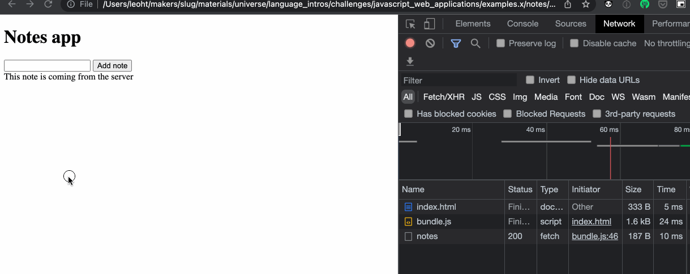

# Test-driving a Client class

## Objectives

 * Test-drive a "Client" class that uses `fetch` to send HTTP requests.

In the previous section, you've setup and run the notes web server. We can send
an HTTP request to this server to retrieve a list of notes, in JSON format.

In this section, you will test-drive a new class `NotesClient` on the notes app
— it will have one method `loadNotes` that fetches the list of notes from that
server. Make sure that the server [setup in the previous section is still running](./13_connecting_to_server.md#downloading-and-running-the-notes-backend), as we will need it for this exercise.

<!-- OMITTED -->


## Mocking `fetch`

The function `fetch` is, by default, not available in a `jest` environment (it
is available only within a browser environment). This means that, if we write a
test for code that uses `fetch`, we'll get the following error:

```
ReferenceError: fetch is not defined
```

We also don't want to make real HTTP requests to a remote API when running tests
— so we need to mock `fetch`.

We'll use the [jest-fetch-mock](https://www.npmjs.com/package/jest-fetch-mock)
package, which makes our life a bit easier. Install it in your notes project to
use it there:

```
npm install --save jest-fetch-mock
```

You can check how it is being used in the file `githubClient.test.js`.

## Template to write a test for a "Client" class

Use this template when you need to test-drive a "Client" class. This class's
purpose is to send HTTP requests using `fetch`.

*Because we mock `fetch`, we actually do not test very much logic here (the
class is just a thin layer standing between the rest of our code and `fetch`).
But this is still a great way to train your testing skills, and to make sure we
separate concerns.*

The following test uses the Jest's `done` function, since we need Jest to "wait"
after the callback has been called. [Revisit the guidance on testing
callbacks](https://github.com/makersacademy/javascript-fundamentals/blob/main/pills/testing_asynchronous_code.md#testing-callbacks),
if needed.

```js
const Client = require('./client');

// This makes `fetch` available to our test
// (it is not by default, as normally `fetch` is only
// available within the browser)
require('jest-fetch-mock').enableMocks()

describe('Client class', () => {
  it('calls fetch and loads data', (done) => {
    // 1. Instantiate the class
    const client = new Client();

    // 2. We mock the response from `fetch`
    // The mocked result will depend on what your API
    // normally returns — you want your mocked response
    // to "look like" as the real response as closely as
    // possible (it should have the same fields).
    fetch.mockResponseOnce(JSON.stringify({
      name: "Some value",
      id: 123
    }));

    // 3. We call the method, giving a callback function.
    // When the HTTP response is received, the callback will be called.
    // We then use `expect` to assert the data from the server contain
    // what it should.
    client.loadData((returnedDataFromApi) => {
      expect(returnedDataFromApi.name).toBe("Some value");
      expect(returnedDataFromApi.id).toBe(123);

      // 4. Tell Jest our test can now end.
      done();
    });
  });
});
```

## Challenge - test-driving the `NotesClient` class

Back to the `notes-app` directory. You'll now test-drive and implement a new
class `NotesClient`. This class should have one method, `loadNotes`, that uses
`fetch` to request the list of notes from the backend.

1. Test-drive and implement the class and method. The `loadNotes` method should
   accept one argument, which is a callback function. The function should use
   `fetch` to load data from the `GET /notes` endpoint, and call the given
   callback with the result.

## Challenge - connecting the `NotesView` and `NotesClient`

1. Change the `constructor` of `NotesView` so an instance of `NotesClient` can
   be dependency-injected into it - your main file should now look like this: 

```js
// index.js
// ...
const client = new NotesClient();
const model = new NotesModel();
const view = new NotesView(model, client);
```

2. Test-drive a new method `displayNotesFromApi()` on the `NotesView` class -
   this method should:
    * call `loadNotes(callback)` on the Client class.
    * when the response data is received, set the list of notes on the model and
      call `displayNotes()`:
    ```js
    // This method is new — you'll need to add it to the model class
    model.setNotes(notes);
    view.displayNotes();
    ```
    * remember to mock the `NotesClient` class in the test — since this is a
      dependency of `NotesView`. If you're not sure of how to do this, you can
      review [the guidance on mocking in
      Jest](https://github.com/makersacademy/javascript-fundamentals/blob/main/pills/mocking_with_jest.md).

3. Change the code in the main file so we call `.displayNotesFromApi()` straight
   away — the view will now immediately load notes from the server and display
   them, when the page is loaded.

```js
// index.js
// ...

const client = new NotesClient();
const model = new NotesModel();
const view = new NotesView(model, client);

view.displayNotesFromApi();
```

When reloading the page, the note coming from the server should be displayed.



## Troubleshooting common issues

 * Running your Jest tests, but getting the error `ReferenceError: fetch is not
   defined` ? It's likely you haven't mocked `fetch` as described above.
 * Not sure how to test the behaviour a method that uses a callback to give back
   its result? You can use `expect()` Jest assertions inside a callback as well:
   ```js
    // An example Jest test
    myMethod(someArgument, (result) => {
      expect(result).toBe(true);
    });
   ```

[Next Challenge](15_creating_new_note_server.md)

<!-- BEGIN GENERATED SECTION DO NOT EDIT -->

---

**How was this resource?**  
[😫](https://airtable.com/shrUJ3t7KLMqVRFKR?prefill_Repository=makersacademy%2Fjavascript-web-applications&prefill_File=contents%2F14_fetch_notes_from_backend.md&prefill_Sentiment=😫) [😕](https://airtable.com/shrUJ3t7KLMqVRFKR?prefill_Repository=makersacademy%2Fjavascript-web-applications&prefill_File=contents%2F14_fetch_notes_from_backend.md&prefill_Sentiment=😕) [😐](https://airtable.com/shrUJ3t7KLMqVRFKR?prefill_Repository=makersacademy%2Fjavascript-web-applications&prefill_File=contents%2F14_fetch_notes_from_backend.md&prefill_Sentiment=😐) [🙂](https://airtable.com/shrUJ3t7KLMqVRFKR?prefill_Repository=makersacademy%2Fjavascript-web-applications&prefill_File=contents%2F14_fetch_notes_from_backend.md&prefill_Sentiment=🙂) [😀](https://airtable.com/shrUJ3t7KLMqVRFKR?prefill_Repository=makersacademy%2Fjavascript-web-applications&prefill_File=contents%2F14_fetch_notes_from_backend.md&prefill_Sentiment=😀)  
Click an emoji to tell us.

<!-- END GENERATED SECTION DO NOT EDIT -->
