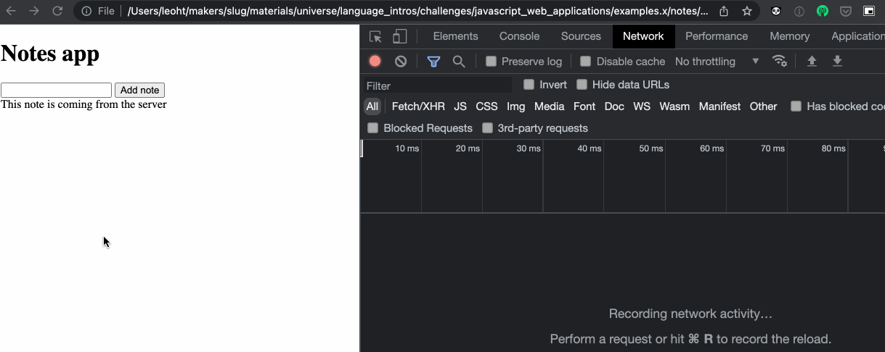

# Creating a new note on the server

## Objectives

 * Use `fetch` to make a POST HTTP request
 * Test-drive the creation of a new note from user interaction.

## Intro

In the previous section, you've created a `NotesClient` class to load the list 
of notes from the backend server.

What about adding a new note? Currently, we only call the model's
`addNote` method. However since our state is managed by the backend, we also
want to call the `POST` endpoint, so the backend will register it.

The backend implements an HTTP endpoint `POST /notes` that we can use to save
the new note.

Here's an example on how we can call this endpoint with the `curl` utility
command (if you don't have it yet, you can download it with `brew install
curl`):

```
$ curl -XPOST http://localhost:3000/notes -H 'content-type: application/json' -d '{ "content": "Remember to reflect on my progress this week!" }'
```

This makes an HTTP request to `http://localhost:3000/notes` with:
 * a `POST` method
 * a `Content-type: application/json` header (necessary to indicate we're POSTing JSON data)
 * a JSON body: `{ "content": "Remember to reflect on my progress this week!" }`

<!-- OMITTED -->

## Exercise 

To complete this exercise, you'll have to **research [how to send a `POST`
request with JSON data using `fetch`](https://developer.mozilla.org/en-US/docs/Web/API/Fetch_API/Using_Fetch#uploading_json_data).**

1. Test-drive a new method `createNote` on the `NotesClient` class. This method
   should send a `POST` request to the notes backend to create a new note.

2. We now want to update the `NotesView` class so that the new method `client.createNote` is called when the user submits the form — test-drive this feature. Remember, here again, to mock the dependency on `NotesClient` in this test.

3. Make sure the view is "refreshed" with the newly created note, by calling `displayNotes()` again.

After completing the exercise, you should be able to do the following in the
browser:
 * type in and submit a new note.
 * see that new note being showed on the page.
* you can also check the `POST` request to `/notes` logged in the console's Network tab.
 * if you refresh the whole page, that new note should also be loaded with the original ones - it means it's been saved correctly.



## Diagramming

This was a lot! Again, taking the time to diagram your understanding of what's
happening can help a lot.

[Next Challenge](16_promises.md)

<!-- BEGIN GENERATED SECTION DO NOT EDIT -->

---

**How was this resource?**  
[😫](https://airtable.com/shrUJ3t7KLMqVRFKR?prefill_Repository=makersacademy%2Fjavascript-web-applications&prefill_File=contents%2F15_creating_new_note_server.md&prefill_Sentiment=😫) [😕](https://airtable.com/shrUJ3t7KLMqVRFKR?prefill_Repository=makersacademy%2Fjavascript-web-applications&prefill_File=contents%2F15_creating_new_note_server.md&prefill_Sentiment=😕) [😐](https://airtable.com/shrUJ3t7KLMqVRFKR?prefill_Repository=makersacademy%2Fjavascript-web-applications&prefill_File=contents%2F15_creating_new_note_server.md&prefill_Sentiment=😐) [🙂](https://airtable.com/shrUJ3t7KLMqVRFKR?prefill_Repository=makersacademy%2Fjavascript-web-applications&prefill_File=contents%2F15_creating_new_note_server.md&prefill_Sentiment=🙂) [😀](https://airtable.com/shrUJ3t7KLMqVRFKR?prefill_Repository=makersacademy%2Fjavascript-web-applications&prefill_File=contents%2F15_creating_new_note_server.md&prefill_Sentiment=😀)  
Click an emoji to tell us.

<!-- END GENERATED SECTION DO NOT EDIT -->
