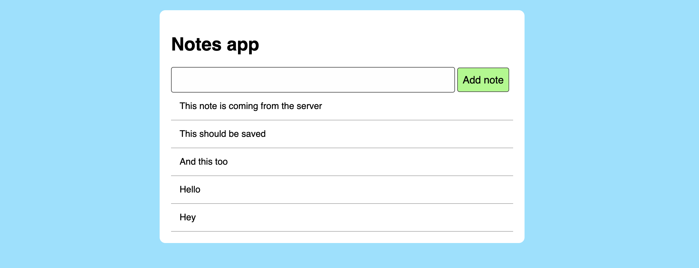

# Making it look nice

You made it this far, congratulations! You've now learned the main concepts for this week:
  * How JavaScript code is built and loaded by a web browser
  * How we use JavaScript to manipulate the page content and handle user interaction
  * How we use JavaScript to make HTTP requests without reloading the page
  * How we can keep a minimal code structure for separation of concerns on a client-side JS app

If you have the time, feel free to backtrack with your pair and re-work on the challenge from the start, to consolidate what you've learned, perhaps making some improvements or using a slightly different approach.

You can also add some CSS to make your app look nicer (see below) or/and work on [some of the post-challenge extension exercises to go further](./19_deleting_note.md).

---

Let's take a break from JavaScript and spend a bit of time making our Notes app
look a bit more appealing. We can do it using some CSS on the web page.

Here's an example if you need some inspiration (and the resulting design below)
— it's also a good occasion to enjoy a bit of CSS styling after all these new
and complex JavaScript concepts. Feel free to modify the different CSS values
and see how it impacts the page!

```css
h1, p, * {
  font-family: sans-serif;
}

html {
  background:#8ae2ff;
}

body {
  background: white;
  width: 600px;
  margin: auto;
  margin-top: 20px;
  padding: 20px;
  border-radius: 10px;
}

.note {
  border-bottom: 1px solid #aaa;
  padding: 15px;
}

input[type=text] {
  width: 80%;
  background: #fefefe;
  border-radius: 4px;
  padding: 10px 8px;
  border: 1px solid #444;
  font-size: 20px;
}

button {
  background: #9efa82;
  border-radius: 4px;
  padding: 10px 8px;
  border: 1px solid #444;
  font-size: 18px;
  cursor: pointer;
}
```



## Additional resources

* [3 ways to add CSS to your web
  page](https://dev.to/amaan56/3-ways-to-add-css-to-your-html-web-page-3k8j)

[Next Challenge](19_deleting_note.md)

<!-- BEGIN GENERATED SECTION DO NOT EDIT -->

---

**How was this resource?**  
[😫](https://airtable.com/shrUJ3t7KLMqVRFKR?prefill_Repository=makersacademy%2Fjavascript-web-applications&prefill_File=contents%2F18_making_it_look_nice.md&prefill_Sentiment=😫) [😕](https://airtable.com/shrUJ3t7KLMqVRFKR?prefill_Repository=makersacademy%2Fjavascript-web-applications&prefill_File=contents%2F18_making_it_look_nice.md&prefill_Sentiment=😕) [😐](https://airtable.com/shrUJ3t7KLMqVRFKR?prefill_Repository=makersacademy%2Fjavascript-web-applications&prefill_File=contents%2F18_making_it_look_nice.md&prefill_Sentiment=😐) [🙂](https://airtable.com/shrUJ3t7KLMqVRFKR?prefill_Repository=makersacademy%2Fjavascript-web-applications&prefill_File=contents%2F18_making_it_look_nice.md&prefill_Sentiment=🙂) [😀](https://airtable.com/shrUJ3t7KLMqVRFKR?prefill_Repository=makersacademy%2Fjavascript-web-applications&prefill_File=contents%2F18_making_it_look_nice.md&prefill_Sentiment=😀)  
Click an emoji to tell us.

<!-- END GENERATED SECTION DO NOT EDIT -->
