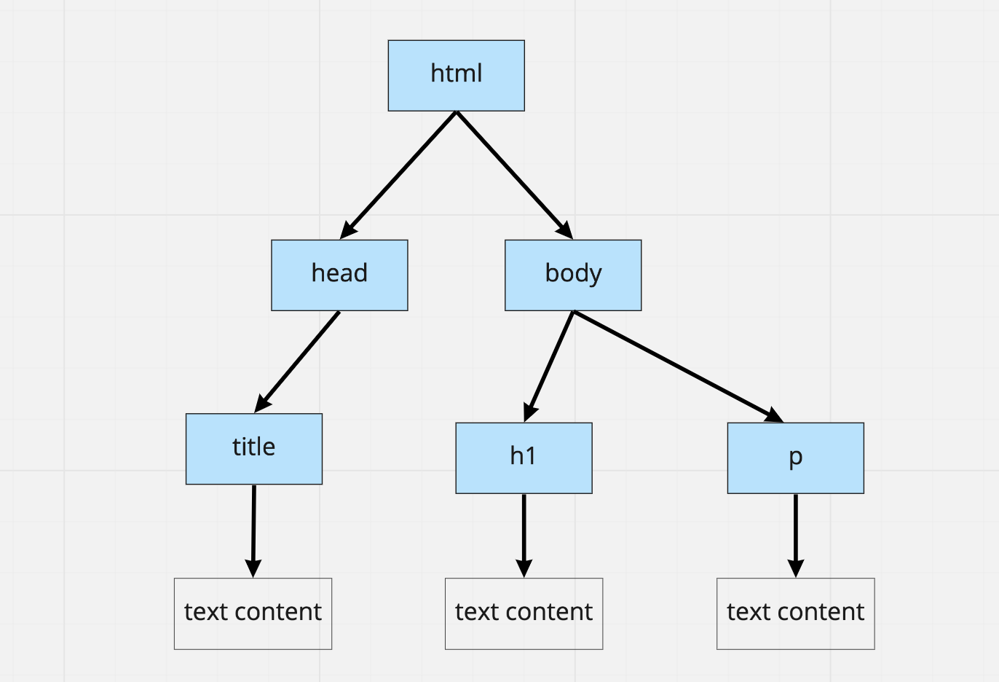

# The DOM and JavaScript

This page contains concise guidance on how to perform simple updates on a webpage using JavaScript. Once you're comfortable with the basic methods described below, you can [research other ways to interact with the page](https://developer.mozilla.org/en-US/docs/Web/API/Document_Object_Model/Introduction#core_interfaces_in_the_dom).

You may want to read or just skim through this page, or use the index below to quickly search for what you need.

## Index

 * [What is the DOM?](#what-is-the-dom)
 * [Using JavaScript, get one element by tag name](#get-one-element-by-its-html-tag-name)
 * [Using JavaScript, get all elements by tag name](#get-an-array-of-elements)
 * [Using JavaScript, get one element by its HTML `id`](#get-one-element-by-its-html-id)
 * [Using JavaScript, get element(s) by their HTML `class`](#get-one-element-by-its-html-class)
 * [Adding a new element on the page](#adding-a-new-element-on-the-page)
 * [Removing an element from the page](#removing-an-element-from-the-page)
 * [How to test DOM changes with Jest]()

## What is the DOM?

When the web browser reads an HTML page sent by a server (perhaps like the web page you're reading right now), it builds up a "tree" of elements in memory. From this tree, the elements are then displayed (or "painted") in the web browser window.

For example, let's say a browser reads the following HTML page:
```html
<html>
  <head>
    <title>Zoe's Cooking Blog</title>
  </head>
  <body>
    <h1>Welcome to my cooking blog!</h1>
    <p>
      Check out my latest pudding recipe!
    </p>
  </body>
</html>
```

The browser will build the following "tree" of elements in memory:



This is called the DOM representation of the page. "DOM" stands for Document Object Model - a representation of the different elements and their hierarchy.

Without JavaScript, this tree is fixed, and there is no way to change the page. But we can use JS functions to modify it dynamically. We also say we can **change the DOM tree**, which is another way to say we're **changing the elements on the page**.

To run through the following sections, you may use the previous HTML code and save it to an HTML file. Open the page with your browser and use the developer console to run the JavaScript code snippets.

## Get one element by its HTML tag name

The function `document.querySelector` is very versatile — first, we can use it to query a specific element on the page by using its tag name. 

For example, in the HTML page from the example above, we can query the paragraph element `<h1>` (main heading) like this:

```js
// 1. We store a "handle" into a variable
const titleElement = document.querySelector('h1');

// 2. We can now interact with the element, e.g modify its text content
titleElement.textContent = 'This is a new title';


// We can shorten the two lines above like this:
document.querySelector('h1').textContent = 'This is a new title';


// 3. Other things that we could do with the element:

// a. Hide it
titleElement.style.display = 'none';

// b. Show it again
titleElement.style.display = 'block';

// c. Set its HTML id (if you don't know what this is, read the section about HTML IDs below)
titleElement.id = 'introduction';

// d. Set its HTML class (if you don't know what this is, read the section about HTML classes below)
titleElement.className = 'blue-paragraph';
```

Try some of the snippets above on the example web page, or on a website you made - or even any other website that you're browsing.

### But where do I run this code?

The code snippets in this page can be run in two ways:
 * as JavaScript files included on the page using a `<script>` HTML tag
 * directly [from the developer console](https://developer.chrome.com/docs/devtools/console/javascript/)

### But what is `document`?

The object `document` is the one we use to access the different methods described here. It is natively accessible when running JS in a browser environment — which is why we don't have to define it — and it comes with a lot of useful methods to interact with the page.

## Get an array of elements

```js
const paragraphs = document.querySelectorAll('p');
```

Something to bear in mind:
* If we use `document.querySelector`, only the first matching element will be returned.
* If we use `document.querySelectorAll`, all the matching elements will be returned.

## Get one element by its HTML ID

> In HTML, we can add an `ID` to an element - this is a label that we, the developer, are choosing to **uniquely identify** this element on the page. This means the same ID cannot be reused twice in the page, so make sure it's specific enough.

```html
<p id="introduction"> 

</p>
```

This ID can be used in CSS to target the element with some custom styling — but we can also use it with `document.querySelector` to target specifically an element by its ID.

The syntax used to do this is called a **selector** - if you've used `querySelector` to get an element by its tag name, you've already used selectors. A tag name is, on its own, a selector:

 * `p` targets any `<p>` element
 * `h1` targets any `<h1>` element
 * `body` targets the `<body>` element

To be more specific and get an element by its ID, we use the ID prefixed by the `#` character:

 * `p#name` targets only the `<p id="name">` element
 * `h1#big-title` targets only the `<h1 id="big-title">` element

Therefore, to query the `<p>` element from the code snippet above, we'd run the following JS code:

```js
const paragraph = document.querySelector('p#introduction');
```

## Get one element by its HTML class

> In HTML, we can add a `class` to an element - this is a label that we, the developer, are choosing. Unlike IDs, we can tag many elements with the same class name.

The way to query elements by their class name is similar to the one we use for IDs — but instead of using the `#` sign as a prefix, we're using the dot (`.`):

 * `p.name` targets **all** the `<p class="name">` elements

Once again:
* If we use `document.querySelector`, only the first matching element will be returned.
* If we use `document.querySelectorAll`, all the matching elements will be returned.

## Adding a new element on the page

With JavaScript, we can also dynamically create new elements on the page. This can be done by following a the following steps:

1. Use `document.createElement` to make a new element
2. Setup any properties for this element, such its the text content
3. Add it on the page with the `.append()` method

For this last step, we can't just add an element anywhere on the page.

Remember that the browser keeps a "tree" representation of all the elements. To insert something new, we need to be specific about **where in the tree** we'd like to insert it. This can be done by getting its "parent" element, and then adding it as a "leaf".

```js
// 1. Make a new element - specifying the tag name
const newElement = document.createElement('p');

// 2. Set its text content
newElement.textContent = "Hey there, I'm new";

// 3. Append it to the body
const body = document.querySelector('body');
body.append(newElement);
```

## Removing an element from the page

The process to remove an element from the page is more straightforward - first, we get the element (using `.querySelector` for example), then we call the `.remove()` method on it.

```js
// 1. Query the element
const elementToRemove = document.querySelector('p#my-paragraph');

// 2. Remove it
elementToRemove.remove();
```

## How to encapsulate inside a "View" class

We can encapsulate the logic described in this page inside a JavaScript class - here's a basic example of this:

```js
class TitleView {
  display(newTitle) {
    document.querySelector('#title').textContent = newTitle;
  }
}
```

Or a more complex example:

Every time we call `.display` with a new title, the targeted DOM element will be modified on the page. This is a simple way to provide some encapsulation in our code, and avoid having too many `document.querySelector()` functions hanging around everywhere in our code. It also helps to separate concerns, as we can keep all the calls to `document.querySelector()` in our View classes.

```js
const titleView = new TitleView();

titleView.display('My new title');
```

## How to test JavaScript code that changes the web page?

Writing tests for JS code that changes the DOM tree can be difficult — that is because we can't just test our JavaScript code in isolation, like we could do for a simple `add(a, b)` function. Our code depends on the DOM tree, and on the methods such as `document.querySelector`, to work. 

Therefore, it's good to keep a few things in mind:
 * Jest runs in the terminal when we run the `jest` command — not in the browser. So by default, Jest is not aware of our HTML code, so we need to set the value `document.body.innerHTML` at the beginning of our tests, as a "mock" of the HTML page. Usually we want this to be as close as possible (or identical) to the real HTML page.
 ```js
 // set the HTML content directly
 document.body.innerHTML = '<html></html>';

 // or better, directly from the HTML file
 const fs = require('fs');
 document.body.innerHTML = fs.readFileSync('./index.html');
 ```
 * We can use most of the methods of `document`, such as `.querySelector()` or `.querySelectorAll()`, to get elements from the page. For this to work, we need to add the comment block below **at the very beginning of the test file**:
 ```js
 /**
  * @jest-environment jsdom
  */
 ```
 * Our tests can follow the "Arrange, Act, Assert" scaffolding:
    * Arrange - setup `document.body.innerHTML` and do any other updates needed on the page
    * Act - the action or behaviour we need to test, maybe a button click
    * Assert - verify the page has been modified

Below is an example of putting all of this together:

```html
<!-- file: index.html -->
<html>
  <head>
    <title>Zoe's Cooking Blog</title>
  </head>
  <body>
    <h1 id="title">Welcome to my cooking blog!</h1>
  </body>
</html>
```

```js
// file: titleView.js

class TitleView {
  display(newTitle) {
    document.querySelector('#title').textContent = newTitle;
  }
}

module.exports = TitleView
```

```js
/**
 * @jest-environment jsdom
 */

// file: titleView.test.js

const fs = require('fs');
const TitleView = require('./titleView');

describe('Page view', () => {
  it('displays new title', () => {
    // 1. Arrange - load the HTML so Jest can build its own DOM tree 
    // and instantiate our View class
    document.body.innerHTML = fs.readFileSync('./index.html');    
    const view = new TitleView();

    // 2. Act - ask the view to display the new title (the DOM tree will change)
    view.display('This is my new title!');

    // 3. Assert - using querySelector,
    // we get the DOM element and assert its content changed
    const titleEl = document.querySelector('#title');
    expect(titleEl.textContent).toBe('This is my new title!')
  });
});
```

### Exercises to go further

Work on these exercises from the project directory above - you can [download the zip archive here](./dom-testing-example.zip).

1. Add an empty paragraph element `<p>` in the HTML page. Test-drive a new class `ParagraphView` using the same pattern that described above to write your test:
   * Arrange - load the HTML and instantiate the new class
   * Act - call a `.display` method on the `ParagraphView` that will change the content of the paragraph
   * Assert - verify the new paragraph content is correct

2. Add a new element `<span id="counter">0</span>` in the HTML page. Test-drive a new class `CounterView` using the same pattern that described above to write your test:
    * Arrange - load the HTML and instantiate the new class
    * Act - call a `.increment` method on this `CounterView` instance that will increment the current value of the counter, and set the new value as the content.
    * Assert - verify the new value displayed is correct.

<!-- BEGIN GENERATED SECTION DO NOT EDIT -->

---

**How was this resource?**  
[😫](https://airtable.com/shrUJ3t7KLMqVRFKR?prefill_Repository=makersacademy%2Fjavascript-web-applications&prefill_File=pills%2Fmanipulating_dom_with_javascript.md&prefill_Sentiment=😫) [😕](https://airtable.com/shrUJ3t7KLMqVRFKR?prefill_Repository=makersacademy%2Fjavascript-web-applications&prefill_File=pills%2Fmanipulating_dom_with_javascript.md&prefill_Sentiment=😕) [😐](https://airtable.com/shrUJ3t7KLMqVRFKR?prefill_Repository=makersacademy%2Fjavascript-web-applications&prefill_File=pills%2Fmanipulating_dom_with_javascript.md&prefill_Sentiment=😐) [🙂](https://airtable.com/shrUJ3t7KLMqVRFKR?prefill_Repository=makersacademy%2Fjavascript-web-applications&prefill_File=pills%2Fmanipulating_dom_with_javascript.md&prefill_Sentiment=🙂) [😀](https://airtable.com/shrUJ3t7KLMqVRFKR?prefill_Repository=makersacademy%2Fjavascript-web-applications&prefill_File=pills%2Fmanipulating_dom_with_javascript.md&prefill_Sentiment=😀)  
Click an emoji to tell us.

<!-- END GENERATED SECTION DO NOT EDIT -->
