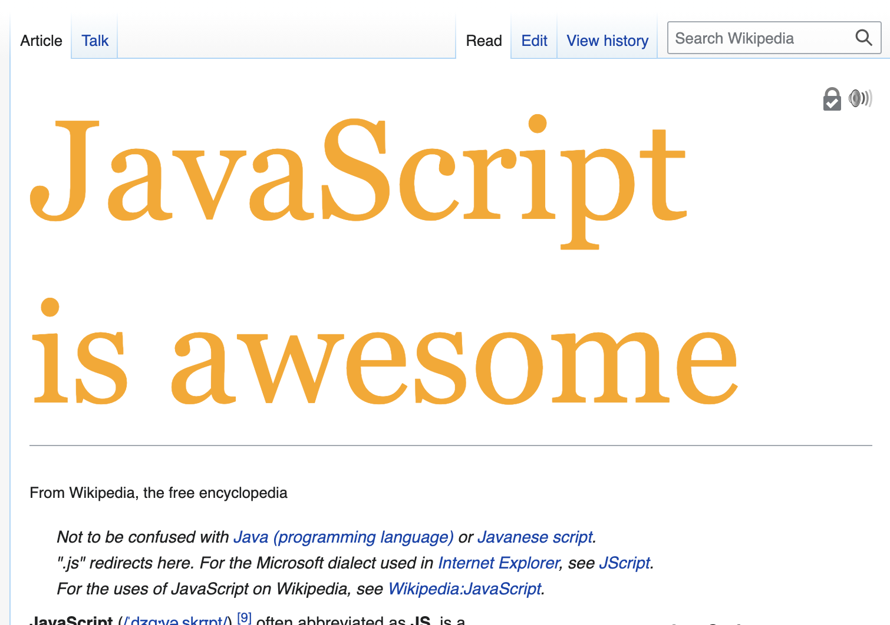

# Exercise: playing with the DOM

### Objectives
 * Learn how to use the DOM API functions to manipulate the page.
 * Learn how to use event listeners to handle user interaction

## Exercise 1 - updating content

Go to the [Wikipedia JavaScript page](https://en.wikipedia.org/wiki/JavaScript) for this exercise, and open the browser console. 

1. Using the "inspect element" browser function (you can right-click on the targeted element you want to inspect), find the HTML ID of the article title "JavaScript".
2. Use `document.querySelector` to "select" the DOM element and assign its value to a JS variable.
3. Use the `.textContent` property to replace the title content by "JavaScript is awesome".
3. Use the `.style` property to change the font size to a big one, such as `120px`, and the colour to orange (be careful — the style properties values need to be set as strings, such as `'20px'`).

You should get to a similar result, *only with typing JavaScript code in the console:*



4. Check on another tab or browser window (or even another computer, if you can). Did the page change? 

## Exercise 2 - adding a picture

We're going to add a cat picture on this Wikipedia page — because, well, why not?

1. Inspect the element just below the main title, which contains "From Wikipedia, the free encyclopedia". Find its HTML id.
2. In the JS console, select this element and assign it to a variable `subTextEl`.
3. Still with JS, find the parent element of `subTextEl` and assign it to a new variable `bodyContentEl`.
4. Still with JS, [create a new `img` DOM element](https://www.w3schools.com/jsref/dom_obj_image.asp#:~:text=Create%20an%20Image%20Object) and assign it to a variable `catImageEl`. Set the `src` property to this image URL: https://makers-cats.herokuapp.com/cat.jpg
5. [Using `.prepend`](https://developer.mozilla.org/en-US/docs/Web/API/Element/prepend#prepending_an_element), add this image element at the beginning of the body element you selected earlier.
6. Nice. But the image is a bit small — let's make it bigger! Set the `.width` property of the image element so it matches the `.offsetWidth` property of the body element.

## Exercise 3 - clicks and cats

This exercise builds on the previous one.

1. Here are a few more cat images URLs, declare a new JS array to store them:

```
https://placekitten.com/408/287
https://placekitten.com/200/286
https://placekitten.com/200/140
https://placekitten.com/300/300
https://placekitten.com/500/350
```

2. Use `.addEventListener` to add an event listener callback on the "click" event on the cat image element inserted in the previous exercise. When the image is clicked, its URL (`.src`) should be changed to a random new one from the array of cat pics URLs declared earlier.


3. Bonus one — here's one of the ways a sound can be loaded and played using JS:
```js
const audioEl = document.createElement('audio');
audioEl.src = '<url to the sound file>';

// later, play it
audioEl.play();
```

Use `.addEventListener` to add an event listener on the image element so the page plays a cat meowing sound (yes, seriously) when the user clicks on the image. You can use the HTML audio element API with the following mp3 URL: https://quicksounds.com/uploads/tracks/1248255507_1254938024_1448995541.mp3

## Going further - explore!

There are a lot more ways to interact with the page and handle user interaction, for example...
 * duplicating, adding and removing elements in a list
 * changing a form input style on key strokes, when the value is not a valid one (e.g a password not long enough makes the field red, or makes a warning message appear)
 * implementing drag and drop with mouse events and JS style properties
 * anything you want!

<!-- BEGIN GENERATED SECTION DO NOT EDIT -->

---

**How was this resource?**  
[😫](https://airtable.com/shrUJ3t7KLMqVRFKR?prefill_Repository=makersacademy%2Fjavascript-web-applications&prefill_File=practicals%2Fplaying-with-dom%2FREADME.md&prefill_Sentiment=😫) [😕](https://airtable.com/shrUJ3t7KLMqVRFKR?prefill_Repository=makersacademy%2Fjavascript-web-applications&prefill_File=practicals%2Fplaying-with-dom%2FREADME.md&prefill_Sentiment=😕) [😐](https://airtable.com/shrUJ3t7KLMqVRFKR?prefill_Repository=makersacademy%2Fjavascript-web-applications&prefill_File=practicals%2Fplaying-with-dom%2FREADME.md&prefill_Sentiment=😐) [🙂](https://airtable.com/shrUJ3t7KLMqVRFKR?prefill_Repository=makersacademy%2Fjavascript-web-applications&prefill_File=practicals%2Fplaying-with-dom%2FREADME.md&prefill_Sentiment=🙂) [😀](https://airtable.com/shrUJ3t7KLMqVRFKR?prefill_Repository=makersacademy%2Fjavascript-web-applications&prefill_File=practicals%2Fplaying-with-dom%2FREADME.md&prefill_Sentiment=😀)  
Click an emoji to tell us.

<!-- END GENERATED SECTION DO NOT EDIT -->
